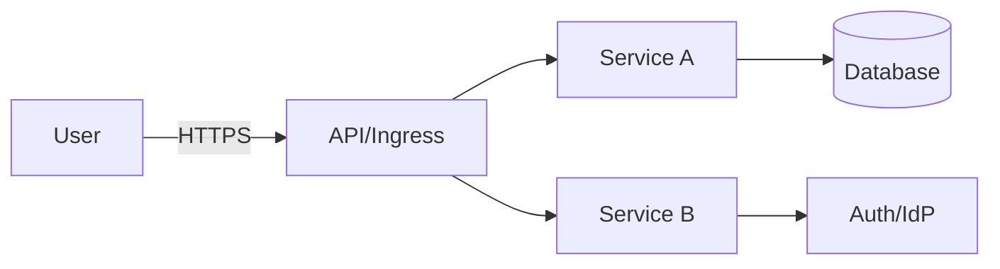

# TM - Требования безопасности + Модель угроз + ADR

> Этот файл - **индивидуальный**. Его проверяют по **rubric_TM.md** (5 критериев × {0/1/2} → 0-10).
> Подсказки помечены `TODO:` - удалите после заполнения.
> Все доказательства/скрины кладите в **EVIDENCE/** и ссылайтесь на конкретные файлы/якоря.

---

## 0) Мета

- **Проект (опционально BYO):** TODO: ссылка / «учебный шаблон»
- **Версия (commit/date):** TODO: abc123 / YYYY-MM-DD
- **Кратко (1-2 предложения):** TODO: что за система и кто ей пользуется

---

## 1) Архитектура и границы доверия (TM1, S04)

- **Роли/активы:** TODO: пользователь, админ; ПДн/токены/платёжные данные/модели …
- **Зоны доверия:** Internet / DMZ / Internal / Device (если есть)
- **Context/DFD:**

  (или приложите файл в `EVIDENCE/dfd-context.png` и дайте ссылку)

- **Критичные интерфейсы и допущения:**  
  TODO: что считаем доверенным/недоверенным; внешние интеграции; админ-доступ; где проходит boundary

---

## 2) Реестр угроз STRIDE (TM2, TM3, S04)

_Минимум: закрыть все буквы **S, T, R, I, D, E**. Оценки **L/I** по шкале 1-5._

| ID  | STRIDE | Компонент/поток | Угроза (кратко)                                   | L | I | L×I |
|-----|--------|------------------|----------------------------------------------------|---|---|-----|
| T01 | **S**  | AUTH             | Подмена личности украденным/поддельным токеном     | 3 | 5 | 15  |
| T02 | **T**  | GW → S1          | Replay-атака, отсутствие nonce/ts                  | 2 | 4 | 8   |
| T03 | **R**  | Audit            | Отказ от действий: нет связки user↔action          | 3 | 3 | 9   |
| T04 | **I**  | S1 → DB          | Инъекции/невалидный ввод                           | 2 | 5 | 10  |
| T05 | **D**  | S1               | DoS/ресурсное истощение без лимитов/таймаутов      | 4 | 4 | 16  |
| T06 | **E**  | Repo/Secrets     | Секреты в коде/логах                               | 2 | 5 | 10  |
| …   | …      | …                | …                                                  | … | … | …   |

> TODO: добавьте доменно-специфичные угрозы (злоупотребления, scraping, многократная регистрация и т.п.).

---

## 3) Приоритизация и Top-5 _(TM3, S04)_

1) **T05 DoS** - L×I=16; публичная экспозиция; нет лимитов/таймаутов.  
2) **T01 Подмена личности** - L×I=15; доступ к ПДн; критичен контур AUTH.  
3) **T04 Инъекции** - L×I=10; риск компрометации БД.  
4) **T06 Секреты** - L×I=10; риск утечек/эскалации.  
5) **T03 Отказ от действий** - L×I=9; требуется трассируемость.  

> TODO: если меняете порядок - укажите 1-2 фактора (экспозиция/чувствительность/частота/обнаружимость).

---

## 4) Требования (S03) и ADR-решения (S05) под Top-5 (TM4)

### NFR-1. Аутентификация и защита токенов

- **AC (GWT):**
  - **Given** валидный токен, **When** запрос `/api/...`, **Then** `200` и `X-User-Id=subject`.
  - **Given** просроченный/поддельный токен, **When** запрос, **Then** `401` и событие `auth.token_invalid` в аудите.

### NFR-2. Лимиты и таймауты

- **AC (GWT):** rate-limit ≤ **N** rps/uid и ≤ **M** rps/ip; timeout ≤ **T** сек; при превышении - `429` + событие `rate_limit_hit`.

### NFR-3. Аудит критических операций

- **AC (GWT):** логируется `correlation_id`, uid, время и результат для операций (`login`, `role_change`, `data_export`, …).

> TODO: при необходимости добавьте свои NFR под Top-5.

---

### Краткие ADR (минимум 2) - архитектурные решения S05

(карточки короткие, по делу)

#### ADR-001 - TODO: название

- **Context (угрозы/NFR):** T01, NFR-1; контур AUTH
- **Decision:** что делаем и где (напр., проверка подписи токена в GW; короткий TTL; rotatable keys)
- **Trade-offs (кратко):** стоимость/производительность/UX
- **DoD (готовность):** измеримые условия (см. раздел 6)
- **Owner:** ФИО/роль
- **Evidence (план/факт):** EVIDENCE/dast-auth-YYYY-MM-DD.pdf#token-tests

#### ADR-002 - TODO: название

- **Context:** T05, NFR-2; публичные endpoint’ы
- **Decision:** rate-limit на GW + server-side timeouts; backpressure
- **Trade-offs:** возможные 429 и влияние на UX
- **DoD:** срабатывание 429 при >N rps; p95 ≤ T сек
- **Owner:** ФИО/роль
- **Evidence (план/факт):** EVIDENCE/load-after.png

---

## 5) Трассировка Threat → NFR → ADR → (План)Проверки (TM5)

| Threat | NFR   | ADR     | Чем проверяем (план/факт)                                                                 |
|-------:|-------|---------|-------------------------------------------------------------------------------------------|
| T01    | NFR-1 | ADR-001 | DAST auth-flow; аудит `auth.token_invalid` → EVIDENCE/dast-auth-YYYY-MM-DD.pdf / audit-sample.txt |
| T05    | NFR-2 | ADR-002 | Нагрузочный тест + проверка 429/таймаутов → EVIDENCE/load-after.png                       |
| T04    | NFR-X | ADR-00X | SAST/линтер на инъекции/параметризацию → EVIDENCE/sast-YYYY-MM-DD.pdf#sql-1              |
| T03    | NFR-3 | ADR-00Y | Анализ образцов аудита → EVIDENCE/audit-sample.txt#corrid                                |

> TODO: заполните таблицу для ваших Top-5; верификация может быть «планом», позже артефакты появятся в DV/DS.

---

## 6) План проверок (мост в DV/DS)

- **SAST/Secrets/SCA:** TODO: инструменты и куда положите отчёты в `EVIDENCE/`
- **SBOM:** TODO: генератор/формат
- **DAST (если применимо):** TODO: стенд/URL; профиль
- **Примечание:** на этапе TM допустимы черновые планы/ссылки; финальные отчёты появятся в **DV/DS**.

---

## 7) Самопроверка по рубрике TM (0/1/2)

- **TM1. Архитектура и границы доверия:** [ ] 0 [ ] 1 [ ] 2  
- **TM2. Покрытие STRIDE и уместность угроз:** [ ] 0 [ ] 1 [ ] 2  
- **TM3. Приоритизация и Top-5:** [ ] 0 [ ] 1 [ ] 2  
- **TM4. NFR + ADR под Top-5:** [ ] 0 [ ] 1 [ ] 2  
- **TM5. Трассировка → (план)проверок:** [ ] 0 [ ] 1 [ ] 2  

**Итог TM (сумма):** __/10
